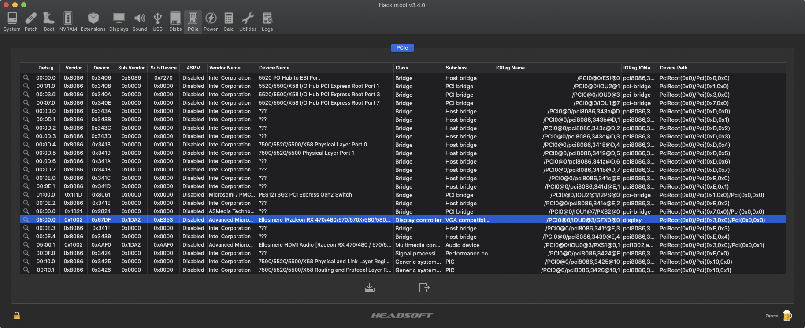

# Install Instructions

This OpenCore installer sample contains hardware components and settings that might not be compatible with your system. It is presented as a learning tool, allowing you to quickly generate and experiment with various OpenCore configurations and components. To use your own system configuration, clone this repo and add your settings.

## Synopsis

The installer configuration demos the following customizations:

- macOS Catalina updates enabled
- OpenCanopy implementation on a black boot screen
- Pulse RX580 GPU hardware acceleration support, through iMacPro hybridization (system specific device path)
- NVMe external disks displayed as internal disks (system specific device path)
- Night Shift enabled

OpenCanopy is a graphical OpenCore user interface that runs in `External PickerMode` and relies on `OpenCorePkg OcBootManagementLib`, similar to the builtin text interface. See the [bugtracker issue](https://github.com/acidanthera/bugtracker/issues/759) details for current development status.

The installer was tested on a classic Mac Pro 5,1 with Python 2.7:

```sh
$ python --version
Python 2.7.16
```

## Repo Clone

To clone the repository, run:

```sh
~$ git clone https://github.com/axivo/opencore.git
~$ cd opencore
```

To clone a specific release, run:

```sh
~$ git clone -b <release tag> --single-branch https://github.com/axivo/opencore.git
```

The `<release tag>` can be [1.0.5](/../..//releases/tag/1.0.5), for example.

Once you cloned the repo, you can run:

- `python tree.py` to generate the components directory tree with all required files, or
- `python config.py` to generate only the Preference List configuration file

Running the components tree builder will always delete the `config.plist` file, make sure you run `python config.py` after.

## Components Directory Tree

The following components are installed:

- [AppleMCEReporterDisabler](https://github.com/acidanthera/bugtracker/issues/424#issuecomment-535624313) (optional, for dual processors)
- [Lilu](https://github.com/acidanthera/Lilu)
  - [NightShiftEnabler](https://github.com/cdf/NightShiftEnabler)
  - [WhateverGreen](https://github.com/acidanthera/WhateverGreen)
- [OpenCorePkg](https://github.com/acidanthera/OpenCorePkg)
  - [OcBinaryData](https://github.com/acidanthera/OcBinaryData), needed for OpenCanopy

Open a terminal and run:

```sh
~$ python tree.py
* OpenCore 0.6.3
  - downloading component... OK
  - building files structure... OK
  - cleaning directory... OK
  - installing AppleMCEReporterDisabler... OK
  - copying OcBinaryData files... OK
* Lilu 1.4.9
  - downloading component... OK
  - building files structure... OK
* NightShiftEnabler 1.0.0
  - downloading component... OK
  - building files structure... OK
* WhateverGreen 1.4.4
  - downloading component... OK
  - building files structure... OK
* Miscellaneous
  - fixing file permissions... OK
```

The `tree.py` command will create the following tree, with all required files:

```text
Volumes
└── EFI
    └── EFI
        ├── BOOT
        └── OC
            ├── ACPI
            ├── Bootstrap
            ├── Drivers
            ├── Kexts
            │   ├── AppleMCEReporterDisabler.kext
            │   │   └── Contents
            │   ├── Lilu.kext
            │   │   └── Contents
            │   │       └── MacOS
            │   ├── NightShiftEnabler.kext
            │   │   └── Contents
            │   │       ├── MacOS
            │   │       └── Resources
            │   └── WhateverGreen.kext
            │       └── Contents
            │           └── MacOS
            ├── Resources
            │   ├── Audio
            │   ├── Font
            │   ├── Image
            │   └── Label
            └── Tools
```

Please note the `AppleMCEReporterDisabler` kext will be installed only if you have dual processors in your Mac.

## Preference List Configuration File

To generate the ASCII `config.plist` file, open a terminal and run:

```sh
~$ python config.py
```

The `config.py` command will create and insert the preference list file into:

```text
Volumes
└── EFI
    └── EFI
        ├── BOOT
        └── OC
            └── config.plist
```

Any configuration changes should be performed only into `config.py` file. It is important not to manually edit the generated `config.plist` file. Instead, take advantage of building your custom configuration with Apple's Python `plistlib` library.

### Configuration Examples

 As detailed into synopsis and to get you familiarized with `plistlib` library, the configuration includes several code examples which you will need to either modify or remove.

#### DeviceProperties Add

This is an example for a `DeviceProperties Add` dictionary with one Pulse RX580 GPU and two NVMe external disks displayed as internal. `Data()` will convert your values to required `Base64` values:

```python
DeviceProperties = {
    'Add': {
        'PciRoot(0x0)/Pci(0x3,0x0)/Pci(0x0,0x0)': {
            'agdpmod': Data('pikera\0'),
            'rebuild-device-tree': Data('\x00'),
            'shikigva': Data('\x50')
        },
        'PciRoot(0x0)/Pci(0x7,0x0)/Pci(0x0,0x0)/Pci(0x0,0x0)/Pci(0x0,0x0)': {
            'built-in': Data('\x00')
        },
        'PciRoot(0x0)/Pci(0x7,0x0)/Pci(0x0,0x0)/Pci(0x8,0x0)/Pci(0x0,0x0)': {
            'built-in': Data('\x00')
        }
    }
}
```

You can use [gfxutil](https://github.com/acidanthera/gfxutil) or [Hackintool](https://github.com/headkaze/Hackintool) to extract the device path of your video card:

```sh
~$ gfxutil -f display
05:00.0 1002:67df /PCI0@0/IOU0@3/GFX0@0 = PciRoot(0x0)/Pci(0x3,0x0)/Pci(0x0,0x0)
```



#### Misc Boot

This is an example of a `Misc Boot` dictionary with OpenCanopy bootpicker showing only when `Esc` key is pressed, on a black screen:

```python
Misc = {
    'Boot': {
        'ConsoleAttributes': 0,
        'PickerMode': 'External',
        'ShowPicker': False
    }
}
```

## Issues

If you experience any Python related problems, please [create an issue](/../../issues). For any technical questions related to [OC configuration](https://github.com/acidanthera/OpenCorePkg/tree/master/Docs), please read the manual or ask your questions in the [MacRumors forums](https://forums.macrumors.com/threads/2207814/).
